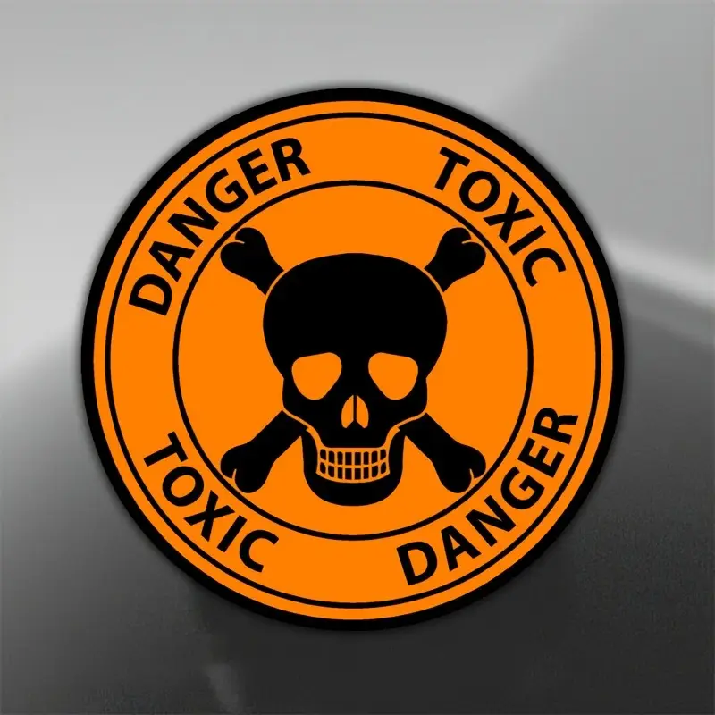

# Agent Orange

  

## Overview
Agent Orange is a chess engine whose ELO is around 1100. It uses the UCI protocol, meaning that it can analyze moves from any given position and can be installed in almost any modern Chess GUI. (Chess Arena is so far the only tested GUI, however). Chess "states" (i.e. piece locations, attacked squares, etc) are all represented in unsigned 64 bit integers, or "bitboards." This allows for extremely fast move generation, as most algorithms consist entirely of integer operations. Agent Orange can calculate over one million moves per second.

## Move Search Strategy
Agent Orange uses the minimax algorithm with alpha-beta pruning in order to find the best move. Each child position is partitioned in such a way that "historically good" moves are evaluated first. That is, moves that caused alpha to be greater than beta and vice versa. Captures are ordered after historically good moves, and all unexplored non-captures are explored last. This move priority heuristic resulted in a roughly 10X speed-up in move searching. 
Branch exploration is not automatically ended upon depth cutoff. Rather, Agent Orange will evaluate all possible capture sequences. This is undodubtedly the strongest aspect of this engine. 

## Position Evaluation
Evaluation is so far slightly simplistic. Agent Orange uses three heuristics: the total amount of piece material, how far advanced the pawns are, and whether the enemy king is checkmated. 
