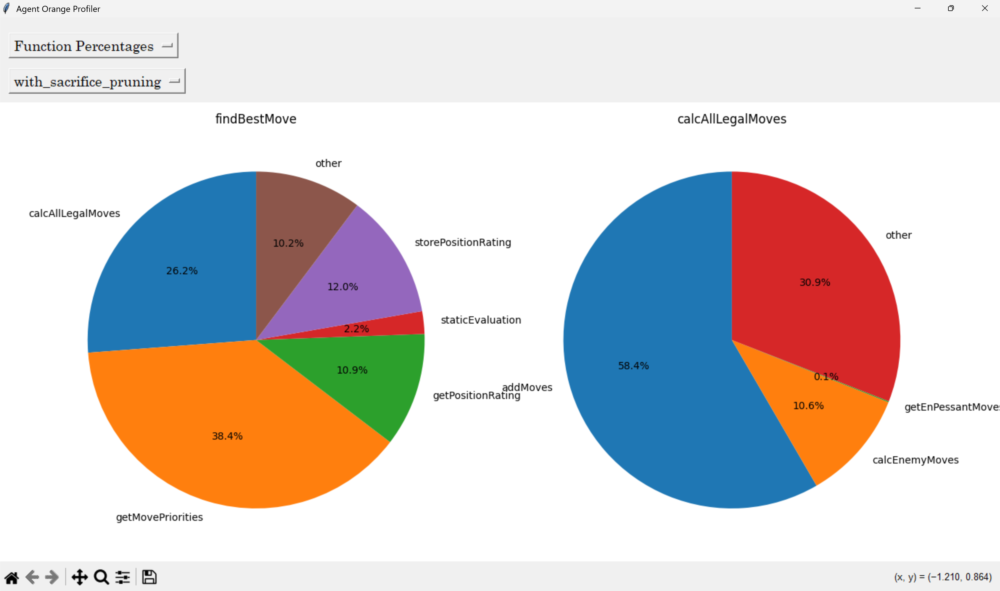

# Agent B

  

## Overview
Agent B is a chess engine. It uses the UCI protocol, meaning that it can analyze moves from any given position and can be installed in almost any modern Chess GUI. (Chess Arena is so far the only tested GUI, however). Chess "states" (i.e. piece locations, attacked squares, etc) are all represented in unsigned 64 bit integers, or "bitboards." This allows for extremely fast move generation, as most algorithms consist entirely of integer operations. Agent B can calculate over two million moves per second.

## 30 Second Installation 

1. Go to releases and download the latest version of Agent B. 
2. Extract the zip folder to any location. The directory should contain agent_b.exe and agent_b_profiling.exe. Note that to use the profiler app, you must have python installed. 

## Usage 

### Installing Agent B in a Chess GUI
1. Open your Chess GUI of choice (Chess Arena is recommended). 
2. Go to the engine management section and add a new UCI engine.
3. Select either the agent_b.exe or agent_b_profiling.exe file from the extracted folder.

### Command Line Usage

Run ./agent_b help to see a list of all available commands. Note that to create a bitboard image, you must set the CHESS_BITBOARD_IMAGES environment variable, which will specify the directory in which the images are stored.

### Profiling

1. Set the CHESS_PROFILING_SESSIONS environment variable to specify the directory in which profiling session files will be stored.
2. Run agent_b_profiling.exe in step 3 above. After the binary exits, a new profiling session file should appear in the specified directory. 
3. Profiling sessions can be visualized inside the custom profiler app. To run this app, first create a custom Python environment in the profiler_visualizer directory. 
4. Run /.venv/Scripts/Activate. Finally, run "python main.py" from the profiler_visualizer directory.

## Move Search Strategy
Agent B uses the minimax algorithm with alpha-beta pruning in order to find the best move. Upon calculating each legal move, Agent B will order them in a way that allows maximum pruning. Captures are ordered first, then historically good moves (i.e. moves that caused alpha to be greater than beta and vice versa), then unexplored non-captures. 

## Position Evaluation
Agent B uses the following three heuristics: piece material, pawn advancement, and whether the enemy king is checkmated. 

## Profiling
Agent B uses a custom profiling app built off Python's Tkinter library. You can look at individual function benchmarks in a bar graph visualization, or at how much relative time they are taking in the engine's evaluation. 

  

