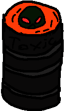

# Agent Orange

  

## Overview
Agent Orange is a chess engine whose ELO is around 1100. It uses the UCI protocol, meaning that it can analyze moves from any given position and can be installed in almost any modern Chess GUI. (Chess Arena is so far the only tested GUI, however). Chess "states" (i.e. piece locations, attacked squares, etc) are all represented in unsigned 64 bit integers, or "bitboards." This allows for extremely fast move generation, as most algorithms consist entirely of integer operations. Agent Orange can calculate over one million moves per second.

## Move Search Strategy
Agent Orange uses the minimax algorithm with alpha-beta pruning in order to find the best move. Upon calculating each legal move, Agent Orange will order them in a way that allows maximum pruning. Captures are ordered first, then historically good moves (i.e. moves that caused alpha to be greater than beta and vice versa), then unexplored non-captures. This move priority heuristic resulted in a roughly 10X speed-up in move searching. 
Branch exploration is not automatically ended upon depth cutoff. Rather, Agent Orange will evaluate all possible capture sequences. This is undodubtedly the strongest aspect of this engine. 

## Position Evaluation
Agent Orange uses the following three heuristics: piece material, pawn advancement, and whether the enemy king is checkmated. 
